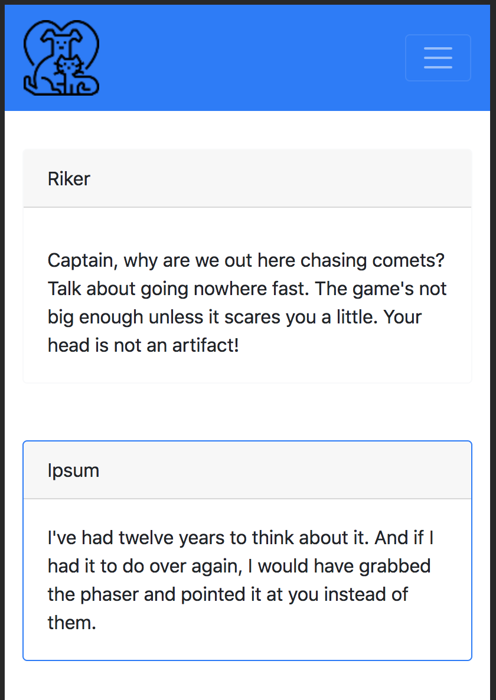
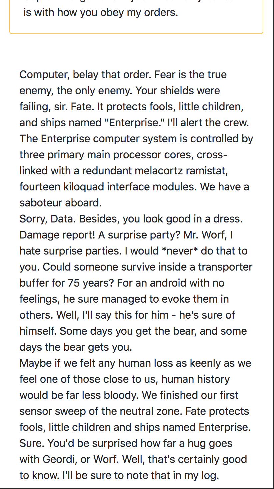

# Snap Challenge: Bootstrap

Create a mobile-responsive website using the Bootstrap framework which reflects what is seen here in the mockup pictures. Only use CSS if you've exhausted all Bootstrap resources.

## Desktop View  

## Mobile View 1  

## Mobile View 2  

## Mobile View 3  

